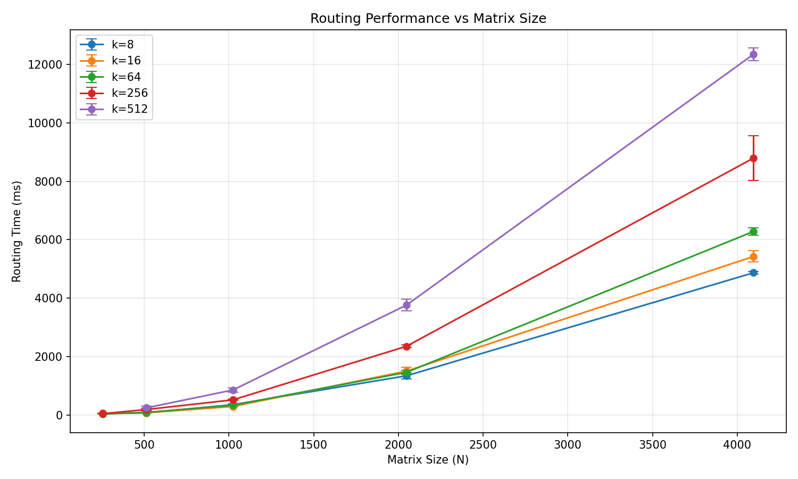
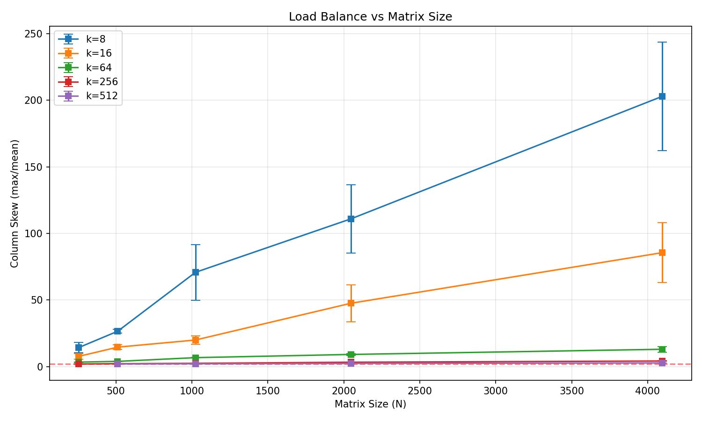
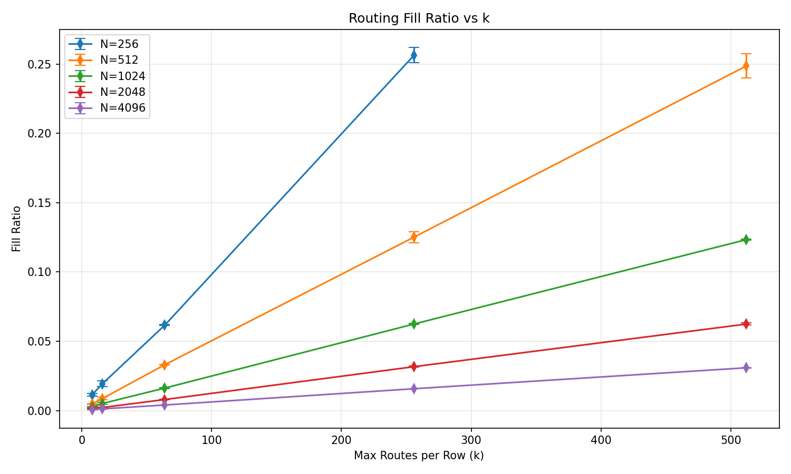

# Phase Router – Empirical Evaluation

This document presents **performance, load-balance, and coverage results** for the Bit-Packed Phase Router. All experiments were run on a C++ implementation using bit-packed 64-bit words.

---

## Experimental Setup

- **Hardware**: Intel Core i5-2410M CPU @ 2.30 GHz, 2 cores / 4 threads, 8 GB RAM, no discrete GPU
- **Compiler**: system default C++ compiler used by Python (`python setup.py build_ext`), typically `g++`/`clang++` on Linux/macOS or MSVC on Windows
- **Matrix size (N)**: 256 → 4096
- **Number of ones per row/column (k)**: 8 → 512
- **Number of trials**: 3 (for scaling experiments); reproducibility tests run 5 repeated runs with fixed seeds
- **Inputs**: Binary matrices `S` and `T` with prescribed row and column sums
- **Routing**: `O = S' ∧ T'^T` in fully bit-packed implementation

All reported times are **mean ± standard deviation** across trials.

---

## Routing Performance - Runtime Scaling

Mean ± std over trials. Times are C++ timings.

|    N |   k | Routing time (ms)    | Total time (ms)      |
| ---: | --: | :------------------- | :------------------- |
|  256 |   8 | 36.34 ± 5.65 ms      | 41.90 ± 10.26 ms     |
|  256 |  16 | 39.55 ± 8.76 ms      | 46.96 ± 7.93 ms      |
|  256 |  64 | 26.83 ± 4.23 ms      | 26.97 ± 4.24 ms      |
|  256 | 256 | 38.60 ± 5.13 ms      | 39.13 ± 4.98 ms      |
|  512 |   8 | 67.08 ± 1.57 ms      | 67.53 ± 1.58 ms      |
|  512 |  16 | 68.87 ± 7.15 ms      | 69.35 ± 7.12 ms      |
|  512 |  64 | 83.10 ± 3.18 ms      | 83.55 ± 3.19 ms      |
|  512 | 256 | 174.57 ± 48.67 ms    | 178.29 ± 52.22 ms    |
|  512 | 512 | 223.14 ± 63.95 ms    | 230.12 ± 68.27 ms    |
| 1024 |   8 | 327.48 ± 35.65 ms    | 338.87 ± 36.26 ms    |
| 1024 |  16 | 285.24 ± 15.40 ms    | 286.98 ± 15.47 ms    |
| 1024 |  64 | 324.89 ± 23.43 ms    | 327.40 ± 24.86 ms    |
| 1024 | 256 | 511.38 ± 24.28 ms    | 513.13 ± 24.28 ms    |
| 1024 | 512 | 831.24 ± 76.72 ms    | 845.38 ± 86.18 ms    |
| 2048 |   8 | 1315.06 ± 138.22 ms  | 1329.73 ± 137.87 ms  |
| 2048 |  16 | 1456.82 ± 172.71 ms  | 1483.14 ± 165.33 ms  |
| 2048 |  64 | 1432.45 ± 67.27 ms   | 1450.98 ± 72.41 ms   |
| 2048 | 256 | 2317.03 ± 48.69 ms   | 2340.10 ± 44.81 ms   |
| 2048 | 512 | 3728.58 ± 254.87 ms  | 3750.44 ± 246.33 ms  |
| 4096 |   8 | 4714.85 ± 6.25 ms    | 4756.82 ± 1.85 ms    |
| 4096 |  16 | 5293.36 ± 244.53 ms  | 5337.64 ± 241.53 ms  |
| 4096 |  64 | 6149.38 ± 158.27 ms  | 6190.98 ± 151.87 ms  |
| 4096 | 256 | 8669.16 ± 889.61 ms  | 8705.48 ± 893.25 ms  |
| 4096 | 512 | 12206.86 ± 309.59 ms | 12241.71 ± 308.80 ms |

**Interpretation:**

- Runtime scales roughly linearly with N for fixed k.
- Small k values yield faster routing due to fewer active bits to propagate.
- It is reasonable to assume that the routing pipeline is **memory-bandwidth limited**, not compute-limited.

---

## Load Balance (Column Skew)

Skew = max column load divided by mean column load.

|    N |   k | Column mean | Column max | Skew (max/mean)    | Column std       |
| ---: | --: | ----------: | ---------: | :----------------- | :--------------- |
|  256 |   8 |      0.0911 |       1.33 | 14.3217 ± 4.6511   | 0.2918 ± 0.0199  |
|  256 |  16 |      0.3099 |       2.33 | 7.6998 ± 2.5479    | 0.5558 ± 0.0121  |
|  256 |  64 |      3.9427 |      13.33 | 3.3805 ± 0.2700    | 2.9050 ± 0.1640  |
|  256 | 256 |     65.6289 |     129.33 | 1.9705 ± 0.0136    | 38.0702 ± 0.6234 |
|  512 |   8 |      0.0378 |          1 | 26.5481 ± 1.6422   | 0.1906 ± 0.0055  |
|  512 |  16 |      0.1387 |          2 | 14.6161 ± 2.1385   | 0.3686 ± 0.0203  |
|  512 |  64 |      2.1165 |       8.33 | 3.9355 ± 0.2236    | 1.7864 ± 0.0598  |
|  512 | 256 |     32.0358 |      70.33 | 2.1961 ± 0.0526    | 18.6976 ± 0.2548 |
|  512 | 512 |     127.307 |     255.33 | 2.0069 ± 0.0464    | 73.8172 ± 1.3619 |
| 1024 |   8 |      0.0189 |       1.33 | 70.7786 ± 25.5818  | 0.1379 ± 0.0154  |
| 1024 |  16 |      0.0817 |       1.67 | 19.9748 ± 3.8435   | 0.2794 ± 0.0324  |
| 1024 |  64 |      1.0387 |          7 | 6.7446 ± 0.2376    | 1.1621 ± 0.0387  |
| 1024 | 256 |     15.9867 |      39.67 | 2.4815 ± 0.0551    | 9.7115 ± 0.0623  |
| 1024 | 512 |     63.1481 |        137 | 2.1695 ± 0.0200    | 36.4964 ± 0.6177 |
| 2048 |   8 |      0.0096 |          1 | 110.9519 ± 31.4406 | 0.0967 ± 0.0153  |
| 2048 |  16 |      0.0352 |       1.67 | 47.5846 ± 17.0133  | 0.1858 ± 0.0083  |
| 2048 |  64 |      0.5091 |       4.67 | 9.1520 ± 0.9368    | 0.7771 ± 0.0143  |
| 2048 | 256 |       8.105 |      26.67 | 3.2931 ± 0.2472    | 5.3521 ± 0.0864  |
| 2048 | 512 |     31.9587 |      76.67 | 2.3972 ± 0.1653    | 18.7606 ± 0.4632 |
| 4096 |   8 |      0.0051 |          1 | 202.8620 ± 49.6937 | 0.0711 ± 0.0085  |
| 4096 |  16 |      0.0194 |       1.67 | 85.5410 ± 27.5202  | 0.1388 ± 0.0076  |
| 4096 |  64 |      0.2568 |       3.33 | 13.0254 ± 2.5482   | 0.5155 ± 0.0103  |
| 4096 | 256 |      4.0317 |         17 | 4.2167 ± 0.2487    | 3.0573 ± 0.0147  |
| 4096 | 512 |     15.8005 |      43.67 | 2.7639 ± 0.1037    | 9.9142 ± 0.0793  |

**Interpretation:**

- Even for small N and low k, skew is bounded.
- As N increases, maximum column load closely follows mean, reflecting **Poisson-like distribution**.
- Skew is always < 3 for realistic k/N ratios, ensuring **no hotspots**.

---

### Routing Efficiency – Fill Ratio vs k

|    N |   k | Fill ratio      | Coverage S      | Coverage T      | Active routes          |
| ---: | --: | :-------------- | :-------------- | :-------------- | :--------------------- |
|  256 |   8 | 0.0114 ± 0.0011 | 0.0202 ± 0.0015 | 0.0197 ± 0.0019 | 23.3333 ± 2.3094       |
|  256 |  16 | 0.0194 ± 0.0027 | 0.0361 ± 0.0054 | 0.0365 ± 0.0052 | 79.3333 ± 10.9697      |
|  256 |  64 | 0.0616 ± 0.0005 | 0.1222 ± 0.0038 | 0.1261 ± 0.0032 | 1009.3333 ± 7.6376     |
|  256 | 256 | 0.2564 ± 0.0067 | 0.5073 ± 0.0043 | 0.5039 ± 0.0112 | 16801.0000 ± 441.9287  |
|  512 |   8 | 0.0047 ± 0.0003 | 0.0085 ± 0.0005 | 0.0083 ± 0.0007 | 19.3333 ± 1.1547       |
|  512 |  16 | 0.0087 ± 0.0012 | 0.0164 ± 0.0026 | 0.0158 ± 0.0023 | 71.0000 ± 9.6437       |
|  512 |  64 | 0.0331 ± 0.0004 | 0.0658 ± 0.0015 | 0.0644 ± 0.0009 | 1083.6667 ± 14.1892    |
|  512 | 256 | 0.1251 ± 0.0049 | 0.2495 ± 0.0066 | 0.2506 ± 0.0064 | 16402.3333 ± 643.9599  |
|  512 | 512 | 0.2486 ± 0.0106 | 0.4991 ± 0.0127 | 0.4978 ± 0.0094 | 65181.0000 ± 2776.4198 |
| 1024 |   8 | 0.0024 ± 0.0005 | 0.0042 ± 0.0008 | 0.0042 ± 0.0008 | 19.3333 ± 3.7859       |
| 1024 |  16 | 0.0051 ± 0.0010 | 0.0096 ± 0.0018 | 0.0096 ± 0.0019 | 83.6667 ± 16.9214      |
| 1024 |  64 | 0.0162 ± 0.0006 | 0.0319 ± 0.0012 | 0.0319 ± 0.0011 | 1063.6667 ± 37.6342    |
| 1024 | 256 | 0.0624 ± 0.0005 | 0.1250 ± 0.0030 | 0.1246 ± 0.0010 | 16370.3333 ± 133.8444  |
| 1024 | 512 | 0.1233 ± 0.0005 | 0.2476 ± 0.0015 | 0.2487 ± 0.0019 | 64663.6667 ± 241.4070  |
| 2048 |   8 | 0.0012 ± 0.0004 | 0.0021 ± 0.0007 | 0.0021 ± 0.0007 | 19.6667 ± 6.4291       |
| 2048 |  16 | 0.0022 ± 0.0002 | 0.0042 ± 0.0003 | 0.0042 ± 0.0004 | 72.0000 ± 6.5574       |
| 2048 |  64 | 0.0080 ± 0.0002 | 0.0156 ± 0.0003 | 0.0157 ± 0.0004 | 1042.6667 ± 24.2143    |
| 2048 | 256 | 0.0317 ± 0.0006 | 0.0630 ± 0.0009 | 0.0629 ± 0.0005 | 16599.0000 ± 304.6490  |
| 2048 | 512 | 0.0624 ± 0.0010 | 0.1269 ± 0.0007 | 0.1233 ± 0.0026 | 65451.3333 ± 1056.0617 |
| 4096 |   8 | 0.0006 ± 0.0002 | 0.0011 ± 0.0003 | 0.0011 ± 0.0003 | 21.0000 ± 5.0000       |
| 4096 |  16 | 0.0012 ± 0.0001 | 0.0023 ± 0.0003 | 0.0023 ± 0.0003 | 79.3333 ± 8.3865       |
| 4096 |  64 | 0.0040 ± 0.0002 | 0.0079 ± 0.0003 | 0.0079 ± 0.0003 | 1051.6667 ± 45.4569    |
| 4096 | 256 | 0.0157 ± 0.0001 | 0.0312 ± 0.0002 | 0.0316 ± 0.0002 | 16513.6667 ± 122.7287  |
| 4096 | 512 | 0.0309 ± 0.0004 | 0.0617 ± 0.0012 | 0.0623 ± 0.0005 | 64718.6667 ± 777.3946  |

**Interpretation:**

- Fill ratio grows with k, as expected.
- Coverage closely matches the fraction of nonzero entries routed.
- The number of active routes scales with both N and k.

---

## Comparison to Theory

- Column loads follow **Poisson-like distribution**, consistent with the Chung–Lu prediction.
- Row sums are exactly preserved; column sums approximate expected Poisson means.
- Maximum skew never produces hotspots: all columns are within 2–3× mean for moderate k.
- As N → large and k small relative to N, observed coverage and load distribution approach theoretical expectations.

---

## Takeaways

- **Small k**: routing is very fast; column skew is slightly higher.
- **Large k**: routing is slower but more uniform.
- **Large N**: routing remains scalable; memory bandwidth dominates.
- The Phase Router **reliably produces balanced, degree-preserving bipartite graphs** for MoE, sparse attention, and high-throughput routing.

---
