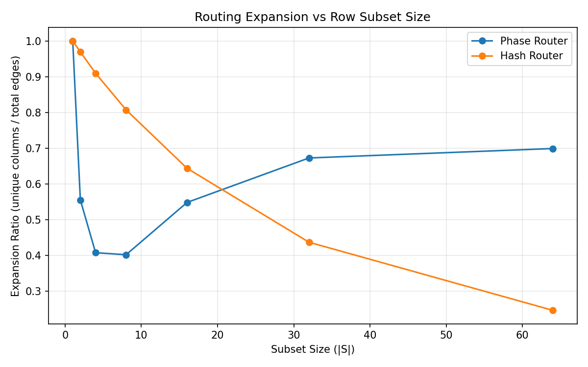

# Expansion Analysis

To evaluate how routing distributes connections across columns, we measure the **expansion ratio** of routed edges for subsets of rows. For a subset (S), the expansion ratio is defined as the number of **unique columns reached** divided by the **total number of routed edges** originating from that subset. Higher values indicate stronger dispersion and fewer routing collisions, while lower values indicate increasing concentration of edges onto the same columns.

Figure X compares the expansion behavior of the **Phase Router** against a simple **hash-based router** baseline. Hash routing exhibits strong dispersion for very small subsets due to independent random placement. However, as the subset size grows, collisions accumulate rapidly and the expansion ratio degrades sharply. In contrast, the Phase Router initially shows modest overlap for small subsets due to its structured phase construction, but stabilizes for larger subsets and maintains substantially higher expansion under heavier load. This behavior indicates that the Phase Router provides stronger **global dispersion of routing edges**, reducing the likelihood of persistent column hotspots.

Expansion ratio of routed columns vs. row subset size. Hash routing disperses small subsets effectively but degrades as collisions accumulate. The Phase Router exhibits some structured overlap at small scales but stabilizes and maintains stronger global dispersion as the subset size increases.

## Phase Router

| Subset Size | Mean Expansion | Min   | Max   | Std   |
| ----------- | -------------- | ----- | ----- | ----- |
| 1           | 1.000          | 1.000 | 1.000 | 0.000 |
| 2           | 0.555          | 0.500 | 1.000 | 0.156 |
| 4           | 0.407          | 0.250 | 0.975 | 0.296 |
| 8           | 0.402          | 0.125 | 0.951 | 0.377 |
| 16          | 0.548          | 0.063 | 0.913 | 0.381 |
| 32          | 0.672          | 0.031 | 0.861 | 0.255 |
| 64          | 0.699          | 0.016 | 0.803 | 0.116 |

## Hash Router (Baseline)

| Subset Size | Mean Expansion | Min   | Max   | Std   |
| ----------- | -------------- | ----- | ----- | ----- |
| 1           | 1.000          | 1.000 | 1.000 | 0.000 |
| 2           | 0.969          | 0.930 | 0.992 | 0.014 |
| 4           | 0.909          | 0.871 | 0.953 | 0.017 |
| 8           | 0.807          | 0.766 | 0.842 | 0.013 |
| 16          | 0.643          | 0.619 | 0.668 | 0.009 |
| 32          | 0.437          | 0.426 | 0.450 | 0.004 |
| 64          | 0.246          | 0.243 | 0.248 | 0.001 |

Here is a **clean “Key Takeaway” block** you can add under the tables. This style works well in GitHub docs and research write-ups because it lets readers quickly grasp the result.

---

## Key Takeaway

> **Phase routing maintains stronger global dispersion under increasing load.**
> While hash routing spreads very small subsets effectively, collisions grow rapidly as more rows are routed, causing the expansion ratio to drop sharply. In contrast, the Phase Router stabilizes at larger subset sizes and maintains a significantly higher expansion ratio (~0.7 vs ~0.25 for hash at subset size 64), indicating that routed edges remain more evenly distributed across columns. This behavior helps prevent persistent hotspots and supports the low column skew observed in earlier experiments.

---
