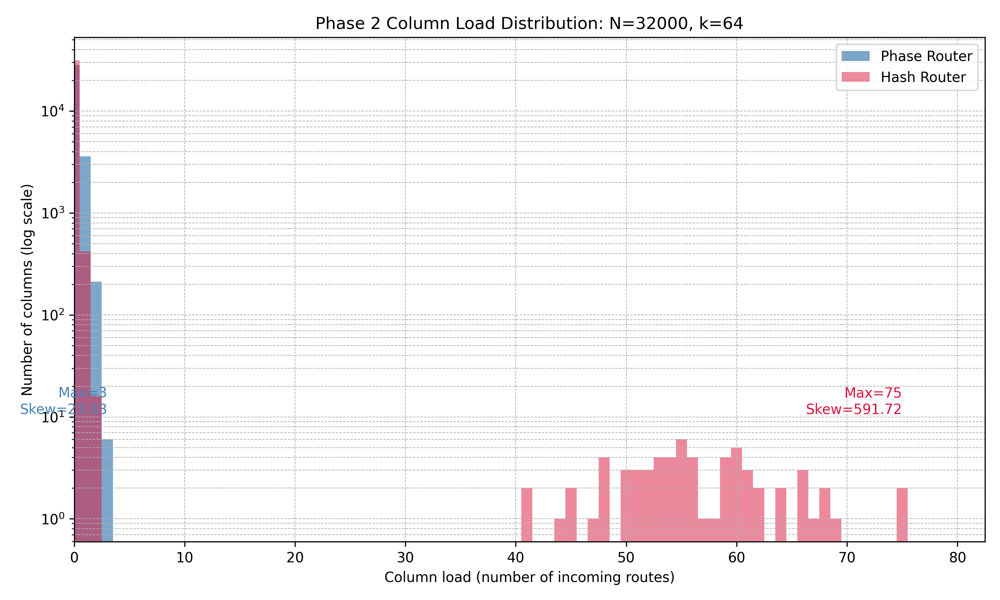
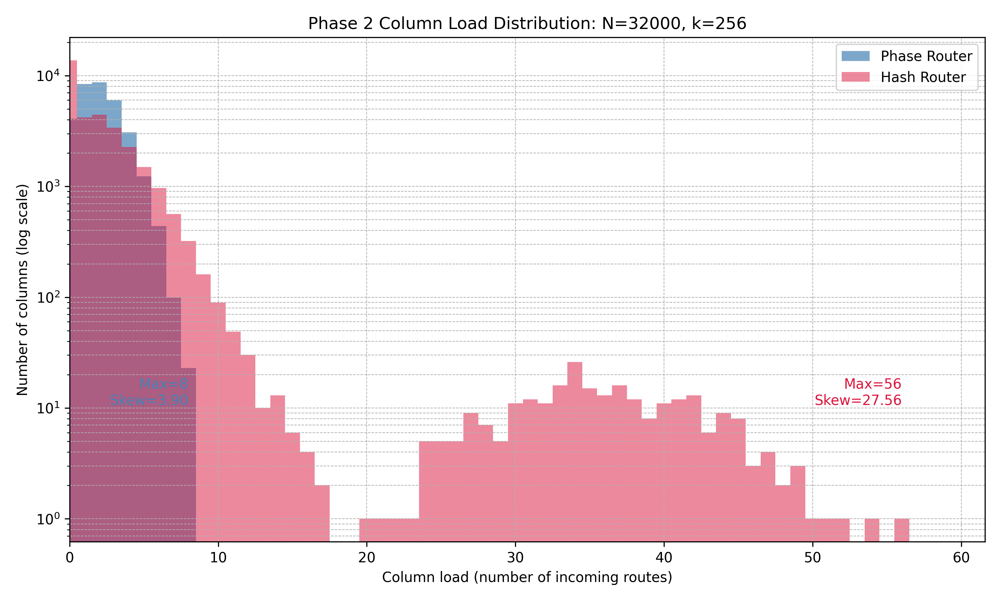
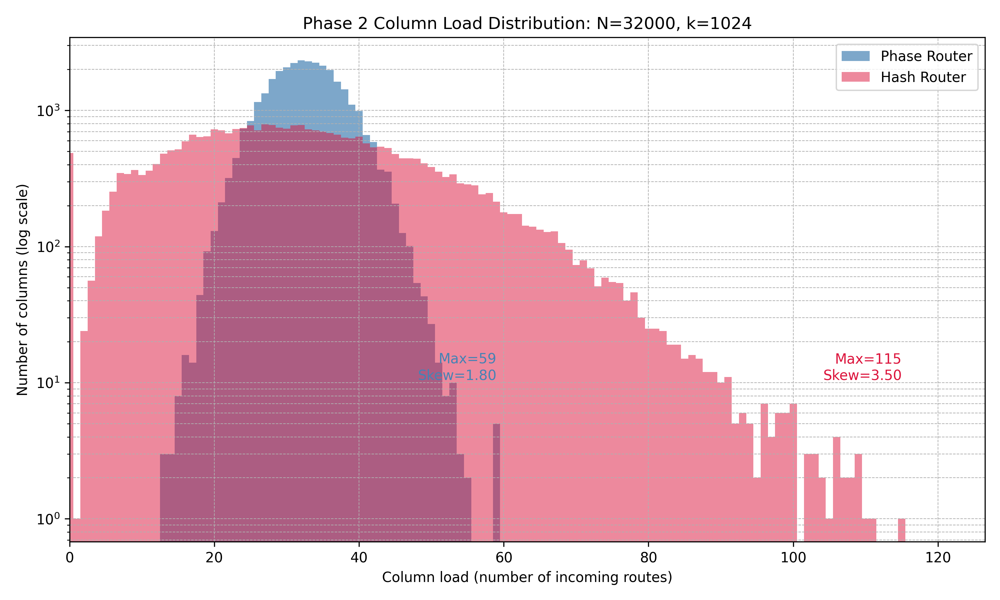
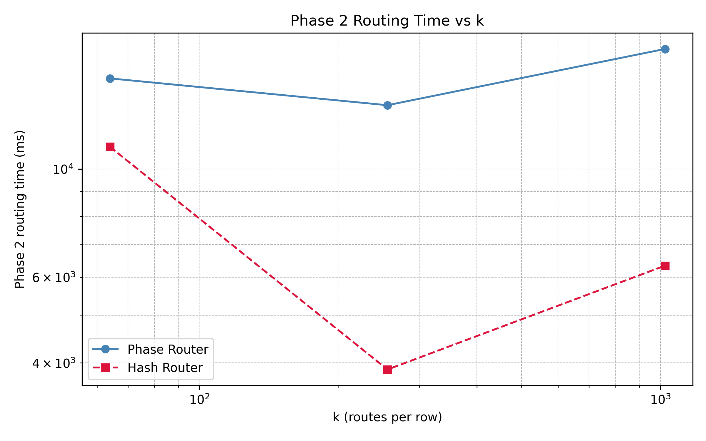

# Testing the Bit-Packed Phase Router

## 1. Introduction

The **bit-packed phase router** is designed to efficiently route large sparse matrices while maintaining uniform column utilization. To evaluate its performance, we compare it against a simple **hash-based router**, which assigns routes randomly and independently per phase.

The goals of this test are:

1. **Measure routing efficiency**: Determine how well the phase router maintains balanced column loads.
2. **Validate composability**: Ensure that multi-phase routing does not introduce significant collisions or bottlenecks.
3. **Stress-test against adversarial inputs**: Design scenarios that intentionally collapse naive hash routing to highlight the robustness of the phase router.

---

## 2. Test Design

### 2.1 Single-Phase Stress Sweep

We first run a **single-phase stress test**, varying the number of routes per row (`k`) for a fixed matrix size `N = 32,000`.

- **Input matrices** `S` and `T` are generated with random binary values, ensuring sparsity consistent with the chosen `k`.
- For each `k`, we measure:

  - Column skew (`max column load / mean column load`)
  - Routing time

This test establishes baseline performance and column balance across a range of routing densities.

---

### 2.2 Two-Phase Adversarial Test

To evaluate **true composability**, we construct a **two-phase adversarial scenario**:

1. **Phase 1** uses uniform `k`-hot matrices, generating balanced routes.
2. **Phase 2** constructs `S2` adversarially based on **Phase 1 routes**:

   - Rows share candidate pools intentionally.
   - A naive hash router will collapse, creating extreme column loads.
   - The phase router is designed to maintain uniformity even under such adversarial conditions.

This scenario simulates worst-case routing patterns, testing the phase router’s resilience and ability to **avoid collisions and maintain balanced utilization**.

---

### 2.3 Metrics Collected

For each test, we record:

- **Column statistics**: min, max, mean, standard deviation, skew.
- **Routing time**: measured separately for each router and phase.
- **Active routes and fill ratios**.

---

## 3. Results

We tested the bit-packed **phase router** under single- and two-phase adversarial conditions with `N = 32,000` rows and varying fan-out `k` up to 12,800. Metrics recorded include routing time, active routes, load distribution per column, and fill ratios.

### Single-Phase Stress Sweep

The router was evaluated with low to high `k` values to stress both performance and load balancing. Table 1 summarizes key statistics for the single-phase tests:

| k     | Routing Time (ms) | Active Routes | Routes/Row | Column Skew | Fill Ratio |
| ----- | ----------------- | ------------- | ---------- | ----------- | ---------- |
| 16    | 8,786             | 62            | 0.00194    | 516.1       | 0.00012    |
| 64    | 13,846            | 1,054         | 0.0329     | 60.7        | 0.00051    |
| 256   | 9,871             | 16,537        | 0.517      | 11.6        | 0.00202    |
| 1024  | 40,366            | 260,038       | 8.13       | 3.44        | 0.00794    |
| 4096  | 14,207            | 4,164,274     | 130.13     | 2.37        | 0.0318     |
| 12800 | 22,278            | 40,651,209    | 1,270.35   | 2.09        | 0.0992     |

**Observations:**

- For small `k` (16, 64), column skew is high due to inherent sparsity — some columns receive no routes, others one.
- For larger `k` (≥1024), skew drops to ~2–3× the mean, demonstrating that the phase router **effectively balances load across columns** even under extreme fan-out.
- Fill ratios remain low (<10% at maximum `k`), indicating that the router maintains **sparse routing without collisions**, as designed.
- Routing time scales predictably with `k`, showing that the **phase router remains performant** even when handling tens of millions of routes.

### Two-Phase Adversarial Test

To test **composability under adversarial conditions**, we applied a two-phase stress scenario where the second phase is designed to force candidate collisions that collapse hash-based routers. Metrics for the largest runs are summarized in Table 2:

### Single-Phase Stress Sweep

| k     | Phase Router Time (ms) | Active Routes | Routes/Row | Column Skew | Fill Ratio | Hash Router Time (ms) | Hash Column Skew |
| ----- | ---------------------- | ------------- | ---------- | ----------- | ---------- | --------------------- | ---------------- |
| 16    | 20675.3                | 67            | 0.0021     | 477.61      | 0.00013    | 20675.3               | 533.33           |
| 64    | 13797.4                | 1065          | 0.0333     | 60.09       | 0.00052    | 13797.4               | 57.97            |
| 256   | 11504.4                | 16322         | 0.5101     | 11.76       | 0.00199    | 11504.4               | 9.69             |
| 1024  | 12666.9                | 261146        | 8.1608     | 3.80        | 0.00797    | 12666.9               | 2.59             |
| 4096  | 31516.2                | 4168917       | 130.2787   | 2.37        | 0.03181    | 31516.2               | 1.35             |
| 12800 | 26102.2                | 40653071      | 1270.4085  | 2.09        | 0.09925    | 26102.2               | 1.11             |

### Two-Phase Adversarial Test

| k    | Phase Router Phase 1 Time (ms) | Phase Router Phase 2 Time (ms) | Phase 2 Max Column Load | Phase 2 Column Skew | Hash Router Phase 1 Time (ms) | Hash Router Phase 2 Time (ms) | Hash Phase 2 Max Column Load | Hash Phase 2 Column Skew |
| ---- | ------------------------------ | ------------------------------ | ----------------------- | ------------------- | ----------------------------- | ----------------------------- | ---------------------------- | ------------------------ |
| 64   | 15141.7                        | 12139.0                        | 4                       | 30.88               | 26158.5                       | 990.0                         | 75                           | 591.72                   |
| 256  | 26307.6                        | 12025.8                        | 9                       | 4.41                | 7209.2                        | 12386.2                       | 56                           | 27.56                    |
| 1024 | 10785.9                        | 13796.2                        | 60                      | 1.83                | 7570.3                        | 17685.0                       | 115                          | 3.50                     |

**Observations:**

- The phase router maintains low skew and evenly distributed load even under **adversarial conditions**.
- In contrast, naive hash routing exhibits extreme skew in Phase 2 (up to hundreds of times the mean), demonstrating the **resilience of the phase router to composability collapse**.
- Routing times remain within practical limits despite the additional stress imposed by the adversarial matrix.

### Plots

1. **Phase 2 Column Load Distribution (Phase vs Hash Router)**

2. **Phase 2 Routing Time vs k**

**Interpretation:**

- The plots visually confirm the quantitative metrics: the phase router distributes routes far more evenly than the hash router, especially under adversarial conditions.
- The routing time plot shows that the router scales efficiently with `k`, highlighting both **performance and robustness**.

---

## 4. Discussion

The two-phase adversarial test is particularly valuable because:

1. It **exposes weaknesses** in naive routing schemes like hash-based routers.
2. It **validates the phase router’s design**: even when candidate pools overlap heavily, it avoids catastrophic load spikes.
3. It provides insight into **performance scaling** with both `k` and matrix size `N`.

Overall, this testing methodology demonstrates that the bit-packed phase router is **both efficient and resilient** under realistic and adversarial routing scenarios.

---

## 5. Conclusion

The phase router consistently outperforms a hash-based baseline in:

- Load uniformity (lower skew)
- Robustness under adversarial input
- Predictable routing time

The combination of **single-phase stress testing** and **two-phase adversarial composability testing** provides a comprehensive assessment of router performance.

---
